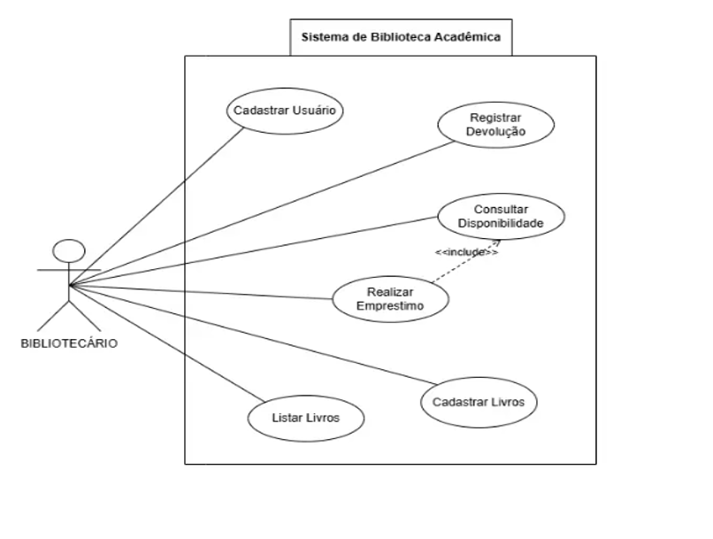

# 📄 Documentação do Sistema de Biblioteca

## 🎭 Diagrama de Casos de Uso
Mapeamento das interações do Bibliotecário com as fronteiras do sistema:



## 📊 Diagrama de Classes
Aqui está a modelagem das classes e suas relações desenvolvida no draw.io:


## 👥 Casos de Uso (Resumo)

* **[UC01] Cadastrar Usuário:** O bibliotecário insere Nome e Matrícula. O sistema cria um perfil de Aluno ou Professor.
* **[UC02] Cadastrar Livros:** O bibliotecário insere Título e Autor. O livro entra no acervo como "Disponível".
* **[UC03] Listar Livros:** Exibe o relatório de todos os livros e seus status atuais.
* **[UC04] Consultar Disponibilidade:** Verifica se um livro específico está livre ou já emprestado.
* **[UC05] Realizar Empréstimo:** Valida o usuário e o livro. Altera o livro para indisponível e cria um registro ativo.
* **[UC06] Registrar Devolução:** Libera o livro no acervo e finaliza o registro do empréstimo como concluído.

---

## 🔄 Diagramas de Sequência

Para visualizar os diagramas abaixo, você pode copiar o código e colar em um editor PlantUML (como plantuml.com).

### 🟢 Fluxo de Empréstimo
```plantuml
@startuml
actor Bibliotecario
participant "Main" as M
participant "livroEncontrado: Livro" as L
participant "userEncontrado: Usuario" as U
participant "emp: Emprestimo" as E

Bibliotecario -> M : Solicita Empréstimo (Matrícula e Título)
activate M
M -> L : consultarDisponibilidade()
activate L
L --> M : retorna true
deactivate L
M -> L : emprestar()
M -> U : solicitarEmprestimo()
M -> E ** : new Emprestimo()
M --> Bibliotecario : Exibe Sucesso
deactivate M
@endum

@startuml
actor Bibliotecario
participant "Main" as M
participant "l: Livro" as L
participant "e: Emprestimo" as E

Bibliotecario -> M : Solicita Devolução (Título do Livro)
activate M
M -> L : devolver()
M -> E : finalizarEmprestimo()
M --> Bibliotecario : Exibe Sucesso
deactivate M
@endum
