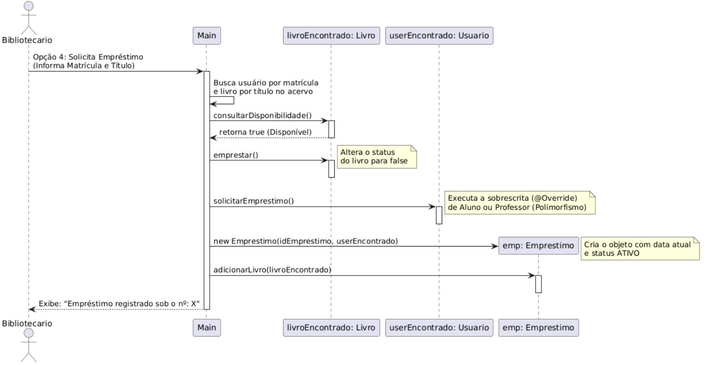
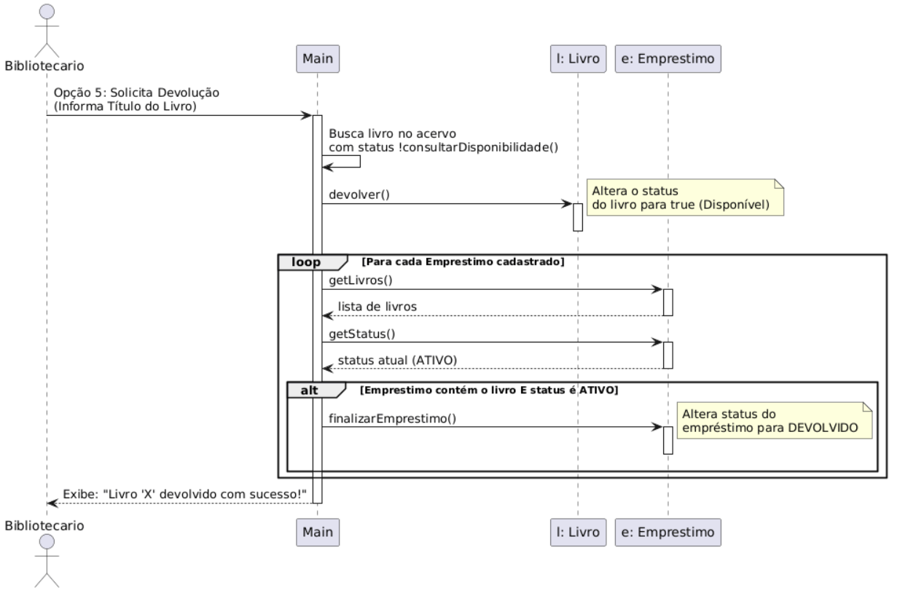

* **[UC01] Cadastrar Usuário:** O bibliotecário insere Nome e Matrícula. O sistema cria um perfil de Aluno ou Professor.
* **[UC02] Cadastrar Livros:** O bibliotecário insere Título e Autor. O livro entra no acervo como "Disponível".
* **[UC03] Listar Livros:** Exibe o relatório de todos os livros e seus status atuais.
* **[UC04] Consultar Disponibilidade:** Verifica se um livro específico está livre ou já emprestado.
* **[UC05] Realizar Empréstimo:** Valida o usuário e o livro. Altera o livro para indisponível e cria um registro ativo.
* **[UC06] Registrar Devolução:** Libera o livro no acervo e finaliza o registro do empréstimo como concluído.

---

# 📄 Documentação do Sistema de Biblioteca

## 🎭 Diagrama de Casos de Uso
Mapeamento das interações do Bibliotecário com as fronteiras do sistema:

## 📊 Diagrama de Classes
Aqui está a modelagem das classes e suas relações desenvolvida no draw.io:

## 🔄 Diagramas de Sequência

### 🟢 Figura 3: Fluxo de Empréstimo
Mapeia a verificação de disponibilidade do livro, a validação da matrícula do usuário e a criação do registro de empréstimo ativo na memória do sistema.

---

### 🔴 Figura 4: Fluxo de Devolução
Mostra o processo inverso, onde o livro retorna para o status disponível e o sistema localiza a ficha correspondente para encerrar a pendência.

M -> L : devolver()
M -> E : finalizarEmprestimo()
M --> Bibliotecario : Exibe Sucesso
deactivate M
@endum
